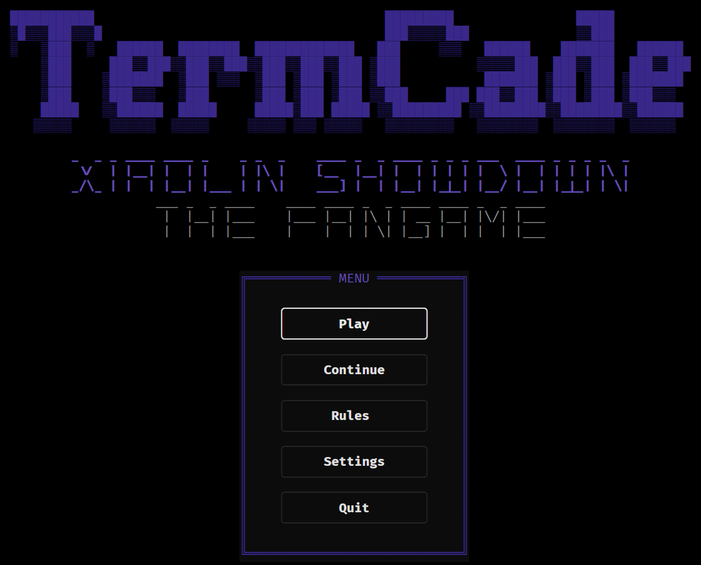
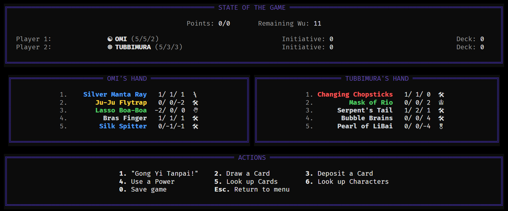

# TermCade

A reusable **Textual** TUI engine for terminal games, plus the games that run on it, in one monorepo. The engine is the long-lived *cabinet*; each game is a finite *cartridge* that plugs into it.

The engine layers with a one-directional purity boundary — `core` (TUI-agnostic services: saves, settings, rng, state) never imports Textual, so it stays unit-testable without a terminal; only `ui` touches Textual.

## Games

- **Xiaolin Showdown** *(1.3, beta)* — Terminal Deck builder. Pick a Character and duel a Bot across a seven-phase showdown: commit stakes, name the Challenge stat and elemental Background, play your cards, and race to the Point limit. Only the winner gets the Shen Gong Wu!




**Under the hood:** characters and Shen Gong Wu carry Force / Agility / Intellect stats, an element, and per-card Powers (deposit / hand / play triggers). The bot names its Challenge stat, elemental Background, and cards by weighing stat deltas against you, with elemental counter-play. All card and game data lives in a bundled SQLite database (`xs_game.db`), and each run is dealt a weighted subset of that pool rather than the whole of it. The deck size and the Point limit are derived from the pool too, so adding Wu re-shapes the game instead of thinning it out.

**Sound:** the soundtrack is generated rather than sampled - a yu (minor pentatonic) scale over quartal chords, which keeps the temple from resolving into a plain major or minor. A boss run is the same tune off the same seed with only the tempo driven up.

**Lore:** the start menu carries a Lore book, read a page at a time.

**Controls:** click any option, or drive it from the keyboard — **Tab** enters focus mode (highlights the first option; press Tab again to leave it), then **↑ / ↓** move the highlight and **Enter** selects. In-game actions also have single-key shortcuts, shown along the footer.

**On a phone** there is no keyboard and none is needed — focus mode is hidden there rather than advertised as a key nobody can press. Tap an option, drag up or down to scroll, and swipe sideways to turn a page in the Lore book. The arcade pushbutton in the corner is Back — it appears only on a screen that has somewhere to go, and only on a touch device.

## Play — no terminal, no Docker

For anyone who just wants to click and go: grab **`TermCade.exe`** — one file, put it anywhere, double-click it. It runs the game in a maximized browser window and auto-sizes to fit your screen; a small console shows the address and stays open while you play (close it to stop). Nothing to install: no Python, no Docker, no terminal. First launch takes a few seconds (it self-unpacks); if SmartScreen prompts once, choose *More info → Run anyway*.

Build it yourself (needs Python this once), then share the single file:

```bash
pip install -e ".[build]"
python build_launcher.py        # -> dist/TermCade.exe  (one movable file, no folder)
```

If the package is already installed, `xiaolin-play` does the same thing — serve locally and open the browser — without freezing an executable.

## Layout

```
engine/termcade/    # the reusable engine package (import: termcade)
  core/             # TUI-agnostic services — saves, settings, rng, state (never imports textual)
  app/              # wiring seam — Game descriptor + GameContext
  ui/               # Textual layer — EngineApp, screens, widgets, theme
games/              # the games (first: xiaolin_showdown)
tests/              # core (no TTY) + Pilot UI tests
```

## Develop & play

```bash
python -m venv .venv
.venv/Scripts/pip install -e ".[dev]"     # Windows; use bin/ on POSIX
pytest

python -m termcade                         # boot the engine attract scene
xiaolin                                    # play Xiaolin Showdown (needs a real terminal)
xiaolin-play                               # play in the browser — serve + auto-open (needs the [serve] extra)
```

## Closed beta

Serving the game to other people needs two things the open server has no answer for: a way to keep
strangers out, and a way to stop testers overwriting each other's saves. One passcode does both — it
is checked at the door, then hashed into that player's own save directory.

```bash
printf 'beta-alpha-1\nbeta-bravo-2\n' > codes.txt    # one per line; # comments ignored
docker compose -f docker-compose.yml -f docker-compose.beta.yml --profile beta up
```

The tunnel container prints a `https://*.trycloudflare.com` URL. Put it in `PUBLIC_URL` and bring
the stack up again — the browser's websocket connects back to that name, so a wrong one loads the
page to a dead terminal. Then hand each tester `<url>/?code=<their code>`; the code moves into a
cookie on first load and leaves the address bar.

Revoking a tester is deleting their line from `codes.txt` — the file is re-read on every request, so
their next session is refused. Their saves stay on disk under `players/`, keyed by a hash of the
code, and come back if the code does.

Set `TERMCADE_CODES` to switch the gate on outside Docker. Unset, the server is open as before.

The page carries the cabinet's icon, so a tester who saves it to a phone's home screen gets the cabinet rather than a screenshot of one.

**Sound plays in the browser, not on the server.** A container has no audio device, and a server
that had one would be playing to an empty room — so a served session sends its samples to the page
and WebAudio mixes them there. The game generates its own audio, so nothing is fetched and no asset
is served: the tune travels once (about 1.2MB for a 22s loop) and every replay after that is free.

Browsers refuse sound to a page nobody has touched, so the soundtrack starts on the player's first
tap or keypress rather than on load. On iOS the hardware mute switch silences it regardless.

## Fonts

Games draw their board with plain Unicode symbols picked for *text* (monochrome) presentation. The icons render as monochrome glyphs anywhere a font covers them; the only catch is that a bare terminal font can lack a glyph and show tofu (☐). A monospace font with good symbol coverage is bundled under `engine/termcade/assets/`, which is also where the browser build reads it from:

- `0xProtoNerdFont-Regular.ttf` — [0xProto](https://github.com/0xType/0xProto), SIL Open Font License
- `TermCadeSymbols.ttf` — a subset of [DejaVu Sans Mono](https://dejavu-fonts.github.io/) (see `DejaVu-LICENSE`, alongside it) covering the punctuation, arrow, technical, box, shape and symbol blocks 0xProto leaves out

Install the first and select it in your terminal to play locally. The few glyphs it misses (the gear, the arrows, the dashes) resolve through whatever your system offers.

The **browser build** (`serve`) embeds both, so nothing needs installing and nothing depends on what the device happens to have — which is what a phone does not have. 0xProto is consulted first, and the symbol subset only for what it lacks.

## Disclaimer

Xiaolin Showdown here is a non-commercial **fan project** — not affiliated with, endorsed, sponsored, or approved by Warner Bros., Cartoon Network, or any rights holder. *Xiaolin Showdown*, its characters, and the Shen Gong Wu names are trademarks of their respective owners, used here descriptively in a non-commercial context.
