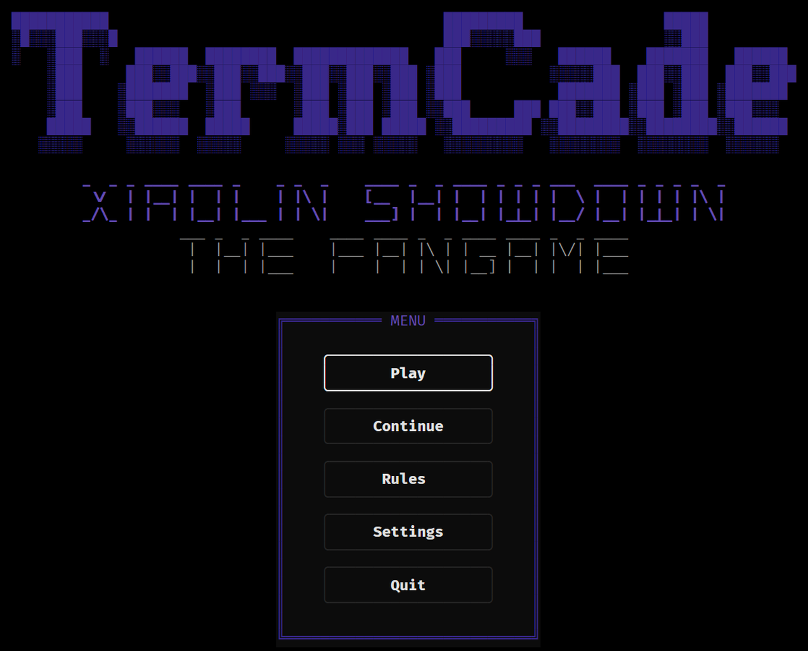
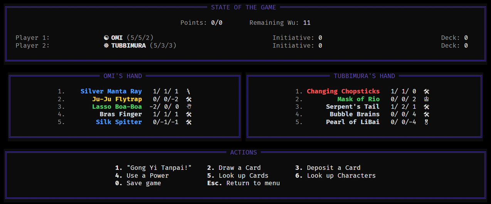

# Xiaolin Showdown

_(1.3, beta)_ — a terminal Deck builder, running on the [TermCade engine](../../README.md).

**Non-commercial fan project** — not affiliated with, endorsed, sponsored, or approved by Warner
Bros., Cartoon Network, or any rights holder. _Xiaolin Showdown_, its characters, and the Shen Gong
Wu names are trademarks of their respective owners, used here descriptively in a non-commercial
context.

Pick a Character and duel a Bot across a seven-phase showdown: commit stakes, name the Challenge
stat and elemental Background, play your cards, and race to the Point limit. Only the winner gets
the Shen Gong Wu!




## Under the hood

Characters and Shen Gong Wu carry Force / Agility / Intellect stats, an element, and per-card
Powers (hand / use / boost / play triggers). The bot names its Challenge stat, elemental
Background, and cards by weighing stat deltas against you, with elemental counter-play. All card
and game data lives in a bundled SQLite database (`data/xs_game.db`), and each run is dealt a
weighted subset of that pool rather than the whole of it. The deck size and the Point limit are
derived from the pool too, so adding Wu re-shapes the game instead of thinning it out.

**Full card list, every stat and power:** [../../docs/xs_game/CARDS.html](../../docs/xs_game/CARDS.html) —
sortable, searchable, generated straight from the DB.

## Beyond the original

- **Four bosses** — Hannibal Roy Bean, Wuya, Chase Young, and Jack Spicer — each a wholly different
  mechanic family (elemental resonance, Shen Gong Wu witchcraft, a stat-boosting Beast Form, and a
  five-headed bot toolkit), picked rather than dealt, and each measurably harder than the ordinary
  Hard tier. Current win rates: [../../docs/xs_game/BALANCE.md](../../docs/xs_game/BALANCE.md).
- **Mala Mala Jong** — hold one Wu of each armor slot plus the Heart of Jong, and a temple power
  transforms your Character into a 6/6/6 construct mid-run: locked hand, boosts only through the
  exiled Heart, and reaching the end of the game in the form is an outright win.
- **A training bar** — a loss teaches you something: a chosen stat climbs toward the cap, the one
  legal way a run tilts in the player's favour without breaking the game's own stat ceiling.
- **A rulebook that tells the truth** — every rule the code enforces is stated in-game, and every Wu
  carries a one-line effect under its flavour text. One card's payout is deliberately never stated
  anywhere — find out by playing it.

## Sound

The soundtrack is generated rather than sampled — a yu (minor pentatonic) scale over quartal
chords, which keeps the temple from resolving into a plain major or minor. A boss run is the same
tune off the same seed with only the tempo driven up.

## Lore

The start menu carries a Lore book, read a page at a time. On a phone, swipe sideways to turn a
page instead of tapping an arrow.

## Play

```bash
xiaolin                                    # needs a real terminal
xiaolin-play                               # play in the browser — serve + auto-open (needs the [serve] extra)
```

For a no-Python, no-terminal way to play, or for hosting a closed beta for testers, see the
[engine README](../../README.md).

## Docs

- [Full card list](https://hjack-rw.github.io/TermCade/xs_game/CARDS.html) — every card, character
  and power, sortable and searchable.
- [Live knobs](https://hjack-rw.github.io/TermCade/xs_game/KNOBS.html) — every tunable value, sortable
  and searchable.
- [Balance, current state](../../docs/xs_game/BALANCE.md) — the boss ladder and every live knob.
- [How a Wu changes hands](../../docs/xs_game/CIRCULATION.md) — the prize cascade, the Early Bird,
  the lost pile.
- [Bosses](../../docs/xs_game/BOSSES.md) — the four boss mechanics and the current ladder.
- [Mala Mala Jong](../../docs/xs_game/JONG.md) — the assembly win-condition.
